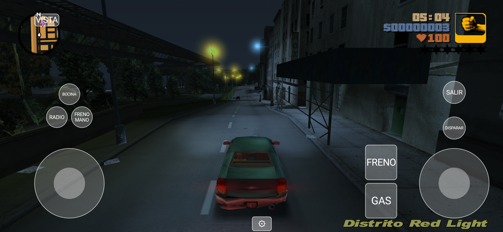
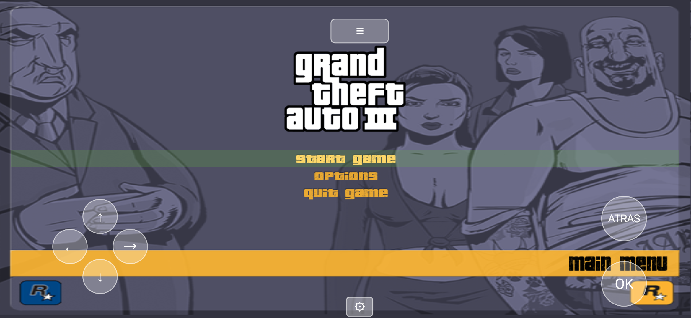

# RE3 Android Evolved

## Intro

En este repositorio vas a encontrar el código fuente completamente reversado de GTA III, con un port a Android completo y jugable agregado en este fork.

re3 (el proyecto original, [GTAmodding/re3](https://github.com/GTAmodding/re3)) fue dado de baja por DMCA en 2021; este fork parte de [mrxenginner/re3](https://github.com/mrxenginner/re3), un mirror preservado del código.

Funciona en Windows, Linux, MacOS, FreeBSD y **Android** (este fork), en x86, amd64, arm y arm64.\
El renderizado lo maneja [librw](https://github.com/aap/librw) (D3D9, OpenGL 2.1+, OpenGL ES 2.0+), la reimplementación open-source de RenderWare.\
El audio funciona con OpenAL.

## 📱 Sobre este fork: RE3 Android Evolved

Este fork es hermano de [revc-android-port-evolved](https://github.com/codepdbh/revc-android-port-evolved) (el mismo trabajo, para GTA Vice City) — misma metodología, mismo autor.

A diferencia de reVC, este repositorio (re3) **no tenía ningún soporte de Android previo, en ningún lado** — ni siquiera un esqueleto parcial. Todo lo que hay en `android/`, `cmake/android/`, `src/skel/android/` y `src/skel/sdl2/` fue portado desde cero, usando revc-android-port-evolved como plantilla y adaptando cada pieza línea por línea contra el código real de este repo (que en varios archivos compartidos seguía siendo GLFW-only, sin la rama SDL2 que reVC ya tenía).

**Estado actual: ✅ jugable de punta a punta.** Compila, instala, arranca, carga los assets, el menú principal responde al tacto (scroll y confirmación), se puede iniciar partida nueva, conducir, disparar y el HUD/radar se ve correcto. Ver capturas abajo y la sección de pendientes para lo que falta pulir.

### ✅ Arreglos aplicados

**Build / compilación**
- `android/launcher/`: proyecto Gradle + CMake completo desde cero (no existía).
- `cmake/android/AndroidConfig.cmake`: conecta los binarios prebuilt de SDL2/OpenAL/mpg123 por ABI a los mismos `find_package()` que usan los builds de escritorio vía Conan. También fuerza `LIBRW_PLATFORM=GL3` y `LIBRW_GL3_GFXLIB=SDL2` en librw (por defecto no tienen equivalente para Android).
- `vendor/librw` re-apuntado a [codepdbh/librw-re3-android](https://github.com/codepdbh/librw-re3-android) (rama `android-sdl2-fixes`): librw nunca había compilado su backend SDL2 para Android — `find_package(OpenGL)` no tiene rama Android (linkeado directo a GLESv3+EGL en su lugar) y `DEVICEGETNUMSUBSYSTEMS`/`DEVICEGETCURRENTSUBSYSTEM`/etc. estaban sin implementar para SDL2 (`assert(0)` en cada arranque — `psSelectDevice()` los consulta siempre).
- `src/CMakeLists.txt`: lib compartida (no ejecutable) en Android, `ANDROID_x32` por ABI, todos los defines que el código espera (`ANDROID`, `RW_GL3`, `LIBRW_SDL2`, etc.).
- `src/skel/crossplatform.h`, `core/Pad.cpp`, `core/Frontend.cpp`, `core/ControllerConfig.cpp`: a diferencia de reVC, ninguno de estos tenía una rama `LIBRW_SDL2` — usaban GLFW sin condicional (`GLFWwindow*` a secas, `GLFW_MOUSE_BUTTON_*`, `glfwGetCursorPos()` directo). Agregadas las ramas SDL2 que faltaban.

**Assets / almacenamiento**
- `GameActivity.getArguments()` pasa `--dir` apuntando a `Almacenamiento interno/re3GTA`, pide "Todos los archivos" (`MANAGE_EXTERNAL_STORAGE`) en runtime si falta.
- `main()` (sdl2.cpp) hace `chdir()` a esa carpeta apenas parsea `--dir` — el motor entero resuelve rutas relativas contra el directorio de trabajo, que en Android no tiene ningún valor útil por defecto.
- `casepath()` (crossplatform.cpp, el resolvedor de rutas case-insensitive): abría `opendir("/")` para cualquier ruta absoluta — Android no lo permite aunque tengas el permiso de almacenamiento. Ahora ancla la resolución en `StorageRootBuffer` (la ruta real y fija de la carpeta del juego) en vez de en `getcwd()`, que era inestable: cada vez que `CFileMgr::SetDir()` cambiaba de subcarpeta y volvía a la raíz, el directorio de trabajo quedaba pegado en la subcarpeta anterior y todas las cargas relativas posteriores fallaban — esto era la causa real de lo que parecía un cuelgue nativo indefinido al arrancar (en realidad `CTxdStore::LoadTxd` reintentando para siempre un `open()` que nunca iba a funcionar).
- `TxdStore.cpp`: el reintento de carga de texturas ahora tiene un límite (1000 intentos) en Android en vez de ser infinito, para que un archivo realmente corrupto/faltante falle con un log en vez de trabar el hilo.
- `CdStream_posix.cpp`: sacado `O_NOATIME` en Android — requiere ser dueño del archivo, y los archivos del juego llegan copiados por otro proceso (adb push, gestor de archivos, MTP por USB), así que siempre fallaba con EPERM.
- `re3.ini` (mINI::INIFile) era un global no-lazy construido con ruta relativa antes de que `--dir` se parsee — ahora es lazy (`GetIniFile()`), se construye recién en el primer uso real.
- `USE_UNNAMED_SEM` ahora también cubre Android (antes solo Switch) — bionic no soporta semáforos con nombre (`sem_open()` siempre falla), abortaba en el primer streaming thread.
- Bug de concatenación sin `/` en la ruta de `gamecontrollerdb.txt` (mismo tipo de bug que reVC tenía en su logger).

**Controles táctiles**
Port completo de la arquitectura de reVC (`TouchControls.h/.cpp`, `TouchControlsView.java`, `CaptureTouchPad()`/`CapturePad()`), pero con la semántica de botones re-verificada contra los bindings reales de GTA III (no asumida igual a reVC):
- III no tiene celular — el botón L1 en el layout "a pie" es "centrar cámara detrás del jugador" (CAM), no "atender teléfono" como en reVC.
- `MapIdToButtonId()` en este repo switchea sobre el orden ordinal de GLFW (nunca tuvo backend SDL2 propio), no sobre `SDL_CONTROLLER_BUTTON_*` como en reVC. `CaptureTouchPad()`/`CapturePad()` usan un enum `GAME_BTN_*` que respeta ese orden GLFW en vez de reusar los índices SDL2 de reVC directamente.
- `InitDefaultControlConfigJoyPad(16)` llamado una vez al arrancar si hace falta (mismo fix que reVC necesitó, mismo motivo: solo se dispara con un gamepad físico conectado).
- **Menú táctil**: tocar una opción ahora la resalta Y la confirma correctamente. `CMenuManager::ProcessButtonPresses()` lee el estado de hover un frame antes de que `Draw()` lo recalcule para la posición actual — un mouse real no lo nota (descansa varios frames sobre el botón antes del clic), pero un toque aparece ya posicionado sobre el botón desde el primer frame. Se retrasa un frame la confirmación del tap (no la posición) para darle tiempo a `Draw()` de calcular el hover correcto antes de leerlo.

**Radar / HUD**
- Radar reposicionado arriba-izquierda (`RADAR_TOP`) en `Radar.cpp` y `Hud.cpp` — el stick de movimiento está abajo-izquierda y lo tapaba.

**Apuntado / target-lock**
- `CCamera::m_bUseMouse3rdPerson` (default `true`, "cámara con mouse en 3ra persona") bloqueaba `FindWeaponLockOnTarget()` por completo — sin mouse en Android, quedaba permanentemente en `true`. Arreglo puntual (variable local, solo dentro de `ProcessPlayerWeapon()`, solo Android) sin tocar la bandera global (también maneja la cámara con stick en otros archivos).

### 📋 Pendientes

- Probado a fondo solo en un dispositivo (Adreno clase Snapdragon 8 Elite, Android 16) — falta feedback de otras GPUs/versiones de Android.
- R3 (mirar atrás / alternar sumisiones) no tiene botón táctil propio en el layout actual (mismo gap que reVC).
- Sin editor de layout en vivo todavía (reVC sí lo tiene) — se podría portar directamente.
- Libs vendored (SDL2/OpenAL/mpg123) no están alineadas a 16KB de página (Android 15+ lo pide para APKs nuevos) — hoy es solo una advertencia de compatibilidad, no bloquea instalación.
- Seguir jugando para encontrar bugs específicos de Android que todavía no aparecieron en las pruebas.

## Installation

- re3 requiere los assets originales del juego — necesitás tener [una copia de GTA III](https://store.steampowered.com/app/12100/Grand_Theft_Auto_III/) legítima.
- **Android**: instalá el APK (ver [Releases](../../releases)), copiá los archivos del juego a `Almacenamiento interno/re3GTA`, concedé el permiso "Todos los archivos" cuando se pida.
- **PC**: compilá desde código fuente (ver más abajo) o descargá un build de [GTAmodding/re3](https://github.com/GTAmodding/re3) (el proyecto original, con builds automatizados para Windows/Linux/MacOS).

## Screenshots

<p float="left">
  
  
</p>

## Improvements

Los mismos cambios y mejoras del re3 original (configurables en `core/config.h`):

* Muchos bugs grandes y chicos arreglados
* Archivos de usuario (guardados y configuración) en la carpeta raíz del juego
* Configuración en `re3.ini` en vez de `gta3.set`
* Menú de debug (Ctrl-M)
* Cámara de debug (Ctrl-B)
* Cámara rotable
* Soporte XInput (Windows)
* Sin pantallas de carga entre islas
* Soporte de peds "skinned" (modelos de Xbox/Mobile)
* Widescreen (HUD, menú y FOV correctamente escalados)
* MatFX, alpha test, partículas, iluminación y lluvia estilo PS2/Xbox
* Menú con mapa, más opciones, configuración de controlador

## Building from Source

### Android

Requisitos: Android SDK + NDK 27.2.12479018, CMake 3.22.1 (instalables vía `sdkmanager`).

```
git clone --recurse-submodules https://github.com/codepdbh/re3-android-port-evolved.git
cd re3-android-port-evolved/android/launcher
```

Creá `android/launcher/local.properties` con `sdk.dir=<ruta a tu Android SDK>`.

Si tu JDK del sistema es muy nuevo para Gradle 8.11.x, agregá a `android/launcher/gradle.properties` (no lo commitees):
```
org.gradle.java.home=<ruta al JBR de Android Studio>
```

Luego:
```
./gradlew assembleDebug
```

El APK queda en `android/launcher/app/build/outputs/apk/debug/`.

### PC (Windows / Linux / MacOS / FreeBSD)

Ver las instrucciones del [re3 original](https://github.com/GTAmodding/re3#building-from-source) — sin cambios en este fork para esas plataformas.

## Contributing

Este fork sigue las mismas reglas de contribución que el re3 original — ver [CODING_STYLE.md](CODING_STYLE.md). Los cambios específicos de Android están detrás de `#if defined ANDROID` en todos lados, no afectan el resto de las plataformas.

## Apoyá el proyecto

Si te sirvió este port, suscribite al canal de YouTube y dejá una ⭐ en el repositorio — ayuda un montón a que más gente lo encuentre.

## License

No estamos en posición de darle una licencia a este código.\
Debe usarse solo con fines educativos, de documentación y de modding.\
No fomentamos la piratería ni el uso comercial.\
Por favor mantené el trabajo derivado open source y dale crédito apropiado.
